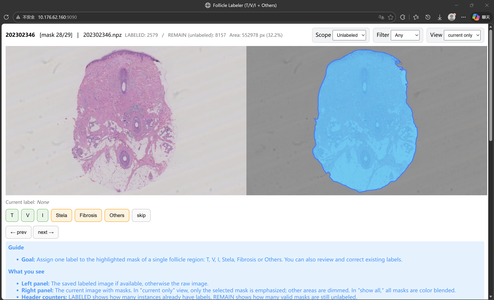
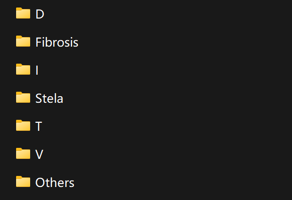
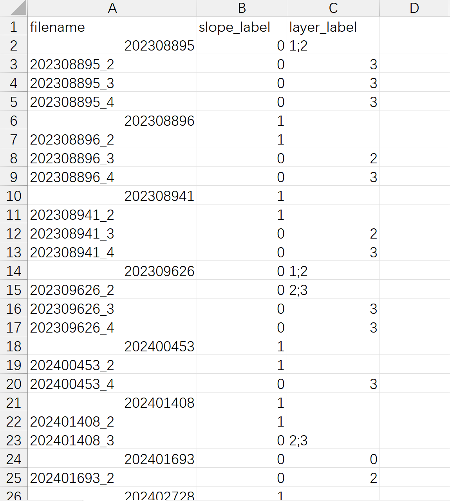
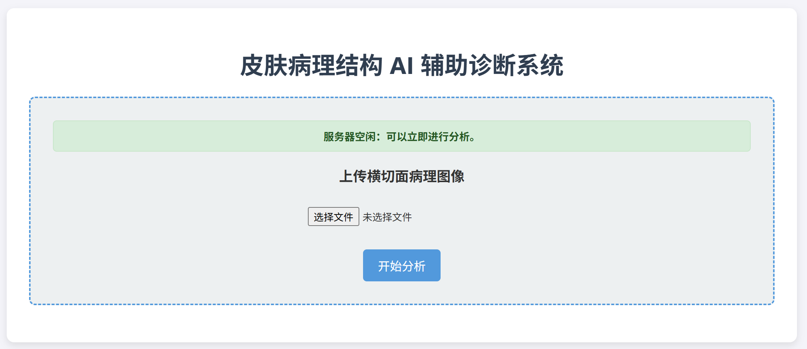
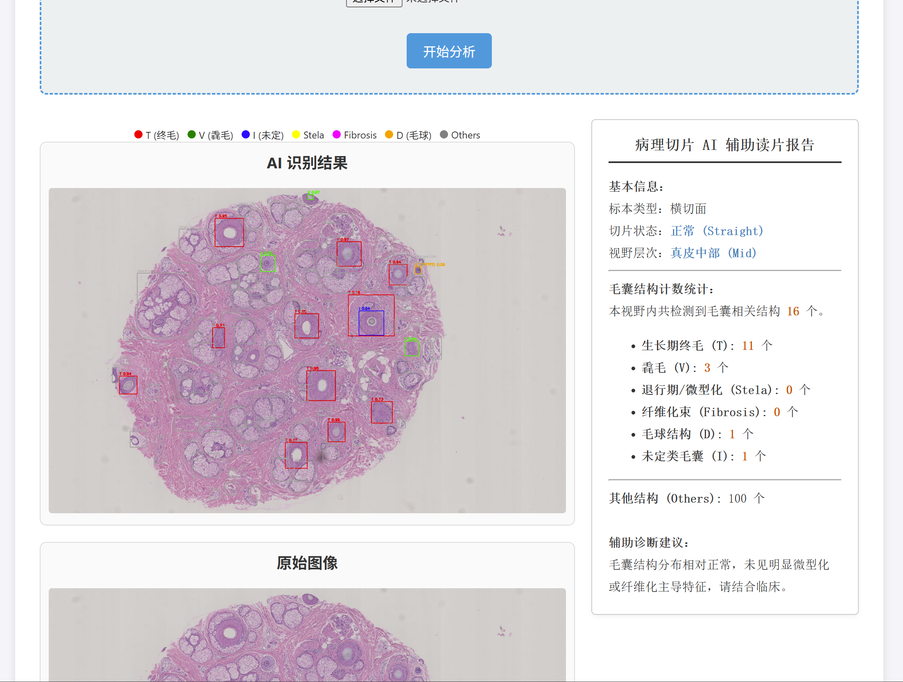

# 🧠 毛囊识别与皮肤结构分析系统

本项目为与华山医院皮肤科合作开发的毛囊结构识别与皮肤层面识别系统，支持：

- 毛囊结构分类（T / V / I / Stela / Fibrosis / D / Others）
- 皮肤层面识别（真皮不同层级 + 皮下脂肪层）
- Web 端推理与辅助读片报告生成（当前为Demo）

---

# 📁 文件目录结构

```text
.
├── app_inference_high_including_reports.py          # Web 推理主程序
├── app_inference_high_including_reports_hybrid.py   # Hybrid Web 推理主程序
│
├── build_cls_dataset.py                             # 构建结构识别数据集
├── build_cls_dataset_eval_mode.py                   # 划分训练/验证集
├── convert_xlsx_to_csv.py                           # Excel 标签转 CSV
├── export_sam_masks.py                              # 生成 SAM 候选 mask
├── label_instances_web.py                           # Web 标注工具
│
├── train_cls_focal.py                               # 训练结构识别模型
├── train_hybrid.py                                  # 训练 hybrid 结构识别模型
├── train_global_models.py                           # 训练层面识别模型
│
├── infer_cls_focal.py                               # 结构识别推理
├── infer_hybrid.py                                  # Hybrid 模型推理
├── eval_layer_matrix.py                             # 层面识别评估
│
├── checkpoints_cls/                                 # 结构识别模型权重
├── checkpoints_global/                              # 层面识别模型权重
├── models/                                          # SAM 模型权重
│
├── cls_dataset/                                     # 结构识别数据集
├── new_dataset/                                     # 手动补充数据集
├── labels/                                          # 标注结果表格
├── data/
│   ├── raw_images/                                  # 原始切片图像
│   └── labeled_images/                              # 医生标注参考图像
│
├── pred_focal/                                      # 本地推理结果
├── static/                                          # Web 上传与缓存数据及结果
├── scene_labels.xlsx                                # 原始层面标签表
└── scene_labels.csv                                 # 转换后的层面标签表
```

---

# ⚙️ 安装依赖

```text
python = 3.9
pytorch
opencv-python
flask
segment_anything
...
```

可按需安装：

```bash
pip install torch opencv-python flask segment_anything
```

---

# 📊 1. 数据标注

## 1.1 结构识别数据集

### 方式一：使用标注工具

```bash
# export sam mask
python export_sam_masks.py

# label
python label_instances_web.py --host 0.0.0.0 --port 9090
```

在浏览器输入终端提示的 IP 地址，进入标注界面，选择蓝色标识区域对应的结构选项。

> 如果认为蓝色标识区域不属于任何一个结构或者不适合标注点击`skip`即可



### 方式二：手动

直接手动截取相应结构，将图片放入：

```text
new_dataset/{train,val}/结构名
```

例如：

```text
new_dataset/train/T/
new_dataset/train/V/
new_dataset/train/I/
new_dataset/train/Stela/
new_dataset/train/Fibrosis/
new_dataset/train/D/
new_dataset/train/Others/
```



## 1.2 层面识别数据集

在 `scene_labels.xlsx` 中填上 `data/raw_images` 中对应切片图的文件名、是否倾斜、以及所属层面。

字段说明如下：

- `filename`：切片图文件名
- `slope_label`：是否倾斜  
  - `0` = 不倾斜  
  - `1` = 倾斜
- `layer_label`：属于哪一层  
  - `0` = 真皮上部
  - `1` = 真皮中部
  - `2` = 真皮下部
  - `3` = 皮下脂肪层
- 若同一张切片同时属于多个层面，可使用分号 `;` 分隔，例如：`1;2`

示例表格如下：



然后运行：

```bash
python convert_xlsx_to_csv.py
```

---

# 🏋️ 2. 训练模型

## 2.1 训练结构识别模型

### 情况一：没有手动加入数据集

```bash
python build_cls_dataset_eval_mode.py --csv cls_dataset/labels.csv --val-ratio 0.2
python train_cls_focal.py
python infer_cls_focal.py
```

### 情况二：加入了手动数据集

```bash
python build_cls_dataset_eval_mode.py --csv cls_dataset/labels.csv --val-ratio 0.2
python train_hybrid.py
python infer_hybrid.py
```

## 2.2 训练层面识别模型

```bash
python train_global_models.py
python eval_layer_matrix.py
```

---

# 🚀 3. 模型推理与应用

```bash
python app_inference_high_including_reports.py

# Added new datasets processing
python app_inference_high_including_reports_hybrid.py
```

在浏览器输入终端提示的 IP 地址，进入应用界面，上传图片。





> 目前读片报告中的文字部分还是固定的。

---

# 📄 4. 说明

## 4.1 结构识别类别说明

当前结构识别任务中涉及的类别包括：

- `T`: 终毛毛囊
- `V`: 毳毛或微型化毛囊
- `I`: 未分类型
- `Stela`: 毛囊索
- `Fibrosis`: 纤维组织替代
- `D`: 毛球
- `Others`: 其他

## 4.2 项目用途

本项目主要用于皮肤病理切片中的毛囊相关结构识别与层面分析，辅助医生进行初步观察与统计分析，不替代临床诊断。

## 4.3 当前限制

- 当前读片报告中的文本部分为固定模板，尚未实现动态生成
- 模型效果依赖于标注数据质量与数量
- 推理结果目前主要用于科研与辅助分析场景

---

